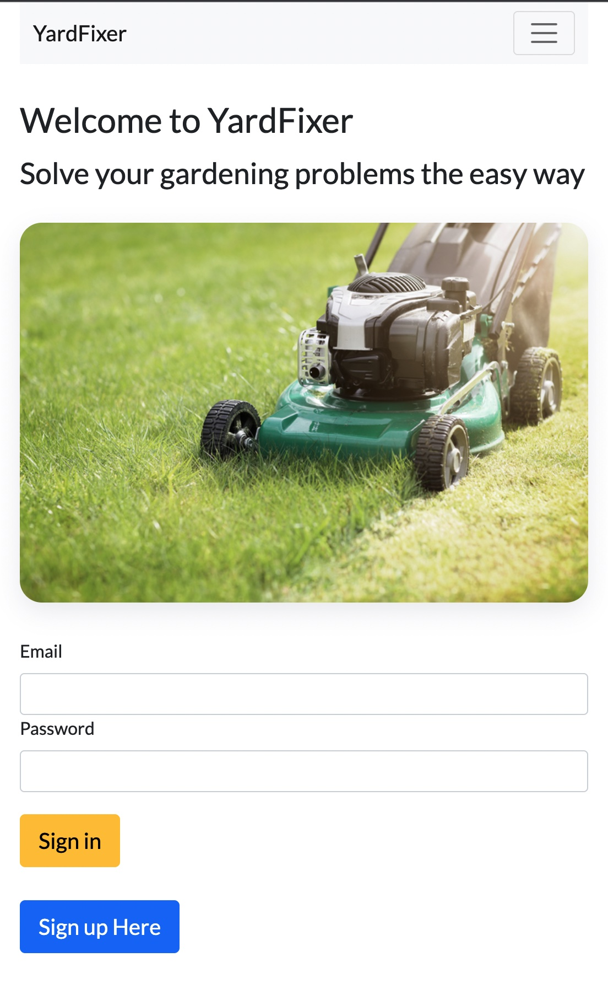
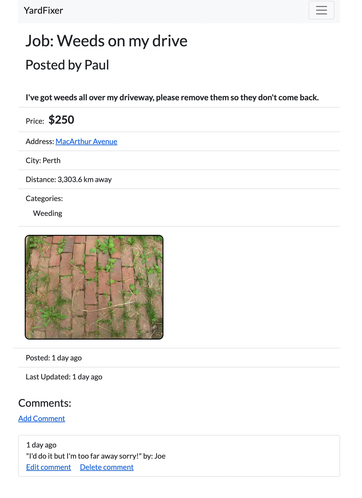
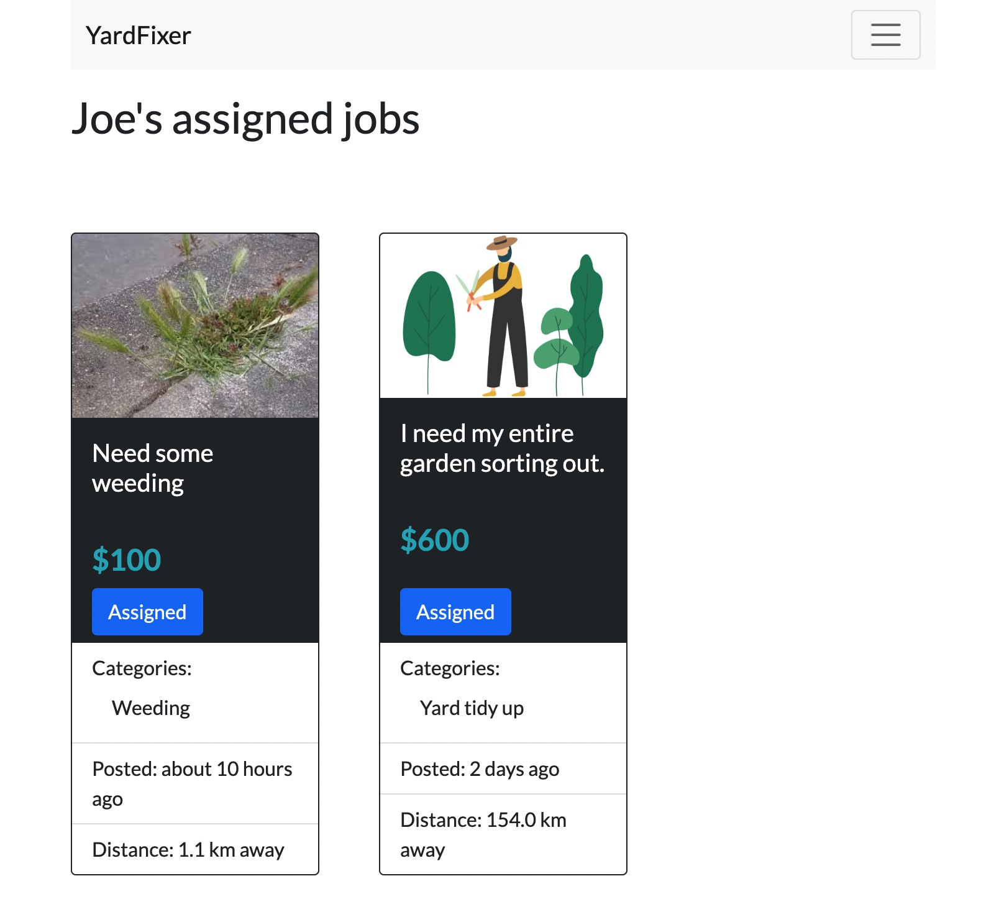

# YardFixer

Welcome to [YardFixer](https://yardfixer.herokuapp.com/)
Solve your gardening problems the easy way

Post a yard maintenance job. Other users can sort and search for jobs that meet their criteria. If they like what they see, they can post a comment and offer to do the job. Pick the best person for the task. Assign the job to them and you can both gain access to each other's contact details to get that yard looking great again!

---------------------------------------------------------------

## Built with

* Ruby on Rails v4.2
* PostgreSQL with Active Record ORM
* bcrpyt (password encryption)
* Google Geocoding API 
* Cloudinary (image storage and optimisation)
* Bootstrap
* CSS

---------------------------------------------------------------
## Introduction

This was my second solo project for the General Assembly Software Engineering Immersive bootcamp, completed in 1 week from this [brief.](https://gist.github.com/wofockham/42880541c94121516109) 

I learnt how plan and execute a larger multi-page web application using Model-view-controller, integrate Ruby gems and APIs to interface with third-party services, deploy and maintain a project on a cloud hosting service (Heroku) and manage test and production databases.

The biggest challenges were getting the Geocoding functionality to work and stylng the many pages to look good across different screen sizes / devices.

---------------------------------------------------------------

## Approach

I started by wireframing the required database tables and their relationships. Then I sketched out the pages needed and how the user would move around the site for the lifecycle of a job post. 

After setting up my models and database structure, I worked on the core site functionality (Sign Up, Sign In, Job Post, Job Edit and Delete & Comments) with minimal styling. Finally I enabled the assignment of jobs from one user to another.

I then implemented Cloudinary image storage and Google Geolocation APIs before styling up using a mixture of Bootstrap elements and custom CSS styles.

Lastly, I completed bug testing and UI testing on different devices and made some changes to handle edge cases of bad user input. I also implemented banner user alert messages.

This is by far the largest software project that I have completed to date. It was great experience in prioritizing tasks and planning my time effectively. I aimed to have a Minimum Viable Product half-way through the week. I could then spend the rest of the week implementing extra 'nice-to-have' features and styling. Styling took longer than I anticipated. This was partly due to learning Bootstrap for the first time, and also wanting to add extra CSS styles to get the pages looking exactly how I intended.

---------------------------------------------------------------

## Features / User Guide

*  Users can [Sign In](https://yardfixer.herokuapp.com/login) from the home page, or click the button link to the [Sign Up](https://yardfixer.herokuapp.com/users/new) page to set up a new account. 
*  A password of at least 6 characters must be used when establishing a new account. Only *first name*, *email* and *password* are required to make the sign up experience pain free.
*  The new user can then access posted jobs on the site but are unable to see **jobs near me** or **post a new job** to the site until they update their User Profile with their full address details.
*  When an address is supplied (suburb is an optional field), location data is requested from Google API and added to that User's database record. 
*  The User will then be able to search for [nearby jobs](https://yardfixer.herokuapp.com/jobs?sort=distance) and see the distance from their address to any job on the site. This supplied address will be used for all posted jobs. It can be changed at any time by clicking on **Edit Profile**.
* A [new job](https://yardfixer.herokuapp.com/jobs/new) can then be posted. One or multiple images can be uploaded. If no images are uploaded a placeholder image will be used for that job post.
*  Only the user's street and City will be visible on the job page. The street will appear as a link to google maps if the Google API was able to validate the user's address data.
* Other users can post a new comment on the post and ask questions/negotiate price etc. Comments can be edited or deleted by their owner.
* The job owner can pick a commenter and assign the job to them. This is done from the **Show Job** page and by clicking the **Assign to..** button next to the relevant comment.
* The job will then by restricted from further edits and will disappear from the [All Jobs](https://yardfixer.herokuapp.com/jobs) page. Both the Job Poster and the Assignee will be able to view the job and see each other's contact details.
* The Assignee will see the job on their **My Assigned** jobs page.
* The Job Poster can then delete the job once completed.

---------------------------------------------------------------

## Links

The site is [online](https://yardfixer.herokuapp.com/) (hosted by heroku)

---------------------------------------------------------------

## Screenshots

---------------------------------------------------------------

## Possible future feature additions

* Better handling of currencies for overseas jobs (currently default currency is $).
* Embed Google Maps Iframe on Job Show page.
* Admin accounts with access rights to delete users and jobs.
* Liked / My Saved Jobs .
* Splitting the All Jobs across multiple pages when the number of jobs reaches a certain quantity.

